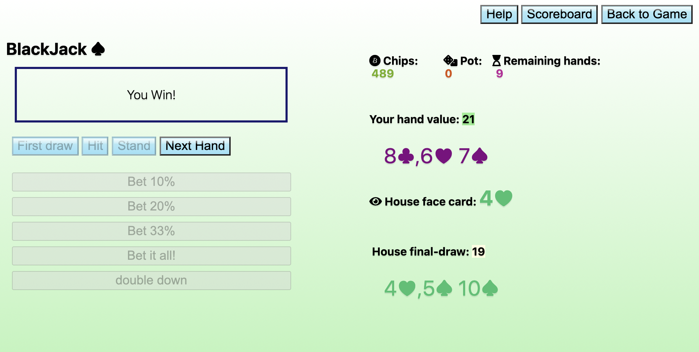

# vanillaJS-blackjack

I started this project with the primary goal of building something of considerable complexity without the aid of a tutorial, guide or framework. As a result my implementation is far from perfect but it works well and i'm proud of what i've achieved so far.

<h2>BlackJack rules</h2>

The aim of the game is to complete 10 hands of blackjack and leave with the highest possible number of chips.

<ol>
<li>
Use the betting buttons to place your bet before drawing your cards.
</li>
<li>
Next, click 'first draw'. You will receive two cards and you will be able to view one of the house cards.
</li>
<li>
You now have three options: Hit, Stand or Double down. 

<ul>
<li>
<b>Hit</b>: If you hit you will receive another card, if your card total is over 21 you will go bust and lose immediately.

</li>
<li>

<b>Stand</b>: If you stand, you will keep your current card total and the house will play their turns. The house must stand on any total above 16. If your total is greater than the house's total at the end of the round you will win double your stake. If the totals are the same you will draw and get what you bet back. If the house has a greater total you will lose what you bet.

</li>
<li>

<b>Double down</b>: If you're feeling lucky you can double your original bet prior to hitting (providing you have enough chips to do so).

</li>
</ul>
</li>
<li>
Picture cards are worth 10. Aces count as 11 (unless you are going to go bust with 11 in which case they will be worth 1)
</li>
<li>
If you draw five cards without going bust, you instantly win the round.
</li>
